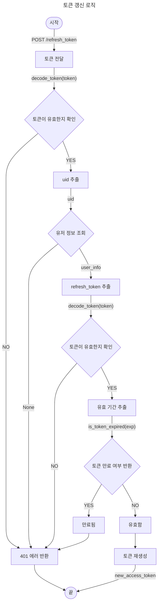

```mermaid
---
title: 토큰 갱신 로직
---
flowchart TD
    Start([시작])
    End([끝])
    InvalidTokenError[401 에러 반환]

    Start-- POST /refresh_token -->A1[토큰 전달]
    A1-- decode_token(token) -->A2{토큰이 유효한지 확인}
    
    A2 -- NO --> InvalidTokenError
    InvalidTokenError-->End
    
    A2-- YES -->A3[uid 추출]
    A3-- uid -->A4{유저 정보 조회}

    A4-- None --> InvalidTokenError

    A4-- user_info -->A5[refresh_token 추출]
    A5-- decode_token(token) --> A6{토큰이 유효한지 확인}

    A6-- NO --> InvalidTokenError
    A6-- YES --> A7[유효 기간 추출]
    A7-- is_token_expired(exp) --> A8{토큰 만료 여부 반환}

    A8-- YES --> 만료[만료됨]
    A8-- NO --> 유효[유효함]

    만료-->InvalidTokenError
    유효-->A9[토큰 재생성]
    A9-- new_access_token -->End
```